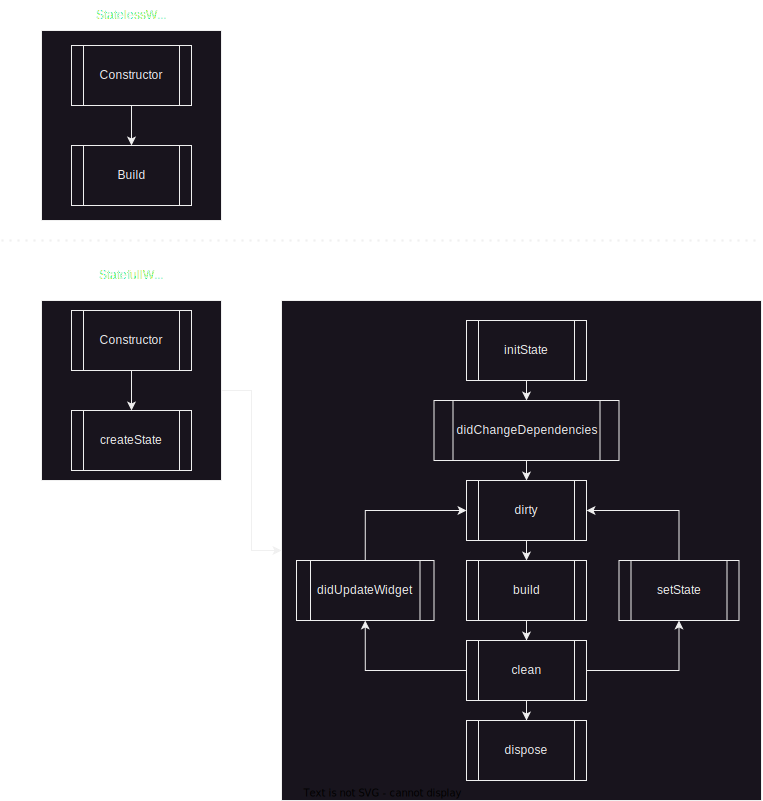

# dojo_flutter_note

## What to expect

1. The app will allow the user make a CRUD in notes "table" with:
- title - String (required)
- description - String (required)
- tag - List<String> (nullable)

2. The app will allow the user to make a CRUD in "tags"table

And that's how the app looks like:


## About the project
The app was created using:
- Flutter 3.7.5
- Dart 2.19.2
- DevTools 2.20.1

## Screens
1. Home screen
	- List the notes saved on the app
	- If there is no note, display a message of empty notes
2. Note detail
	- It's possible to navigate to this screen by:
		- Adding a new note
		- Taping an existing note
	- If the navigation happened by creating a new note, the fields (title, description and tags) will be empty and ready to receive input
	- If the navigation happened by taping an existing note, the fileds will be populated and ready to be edited

## Run on your PC
- [Setup Flutter on your device](https://docs.flutter.dev/get-started/install)
- open the terminal on project folder
- execute the command `flutter pub run build_runner build --delete-conflicting-outputs` to generate the database
- still in terminal with a connected device execute `flutter run`

---
# DOJO
- [Flutter](#flutter)
- [Dart](#dart)
- [Views in Flutter](#views-in-flutter)
- [State management](#state-management)
- [Navigation](#navigation)

---
## [Flutter](https://docs.flutter.dev)
Flutter is a framework developed by Google, it uses [Dart](#dart) as programing language.
Work in a reactive way, where states are set and when they are updated the screen responds properly, more about it in [Views in Flutter](#views-in-flutter).

It allows developers to build applications to many platforms at once (Android, iOS, Web, Windows, Mac), many packages doesn't support all platforms, so it would be necessary to wrap it and handle the scenario where the app is running on a platform not supported by used pacakges.

You can find libraries to use in [pub.dev](https://pub.dev).

---
## [Dart](https://dart.dev/overview)

Dart is the programing language used in the framework, it's Object Oriented and if your app doens't need features that require devices specific functions, that's the only language that you need to know.

There are ways to create your own pakcage that will make the comunication with the desired platform.

> Dart packages

> General packages written in Dart, for example the path package. Some of these might contain Flutter specific functionality and thus have a dependency on the Flutter framework, restricting their use to Flutter only, for example the fluro package.

> Plugin packages

> A specialized Dart package that contains an API written in Dart code combined with one or more platform-specific implementations.

> Plugin packages can be written for Android (using Kotlin or Java), iOS (using Swift or Objective-C), web, macOS, Windows, or Linux, or any combination thereof.

[Official documentation](https://docs.flutter.dev/packages-and-plugins/developing-packages)

Dart is a type-safe language, you can declare varibales like this:

```dart
String name = 'Massula';
int age = 27;
double height = 1.77;
var thisIsAStringToo = 'Another string';
```

Available types:
- Numbers (int, double)
- Strings (String)
- Booleans (bool)
- Records ((value1, value2))
- Lists (List, also known as arrays)
- Sets (Set)
- Maps (Map)
- Runes (Runes; often replaced by the characters API)
- Symbols (Symbol)
- The value null (Null)

---
## [Views in Flutter](https://docs.flutter.dev/get-started/flutter-for/android-devs#what-is-the-equivalent-of-a-view-in-flutter)

While in Android we have `View`, in Flutter we have the `Widget`.

Some differences are?
- the `View` is writen in `XML` and the `Widget` is writen in `Dart`
- `Widgets` are immutable

> In Android, you update your views by directly mutating them. However, in Flutter, Widgets are immutable and are not updated directly, instead you have to work with the widget’s state.

Which lead us to the next topic.

---
## [State management](https://docs.flutter.dev/data-and-backend/state-mgmt/ephemeral-vs-app)
There are two **main** kinds of Widgets in Flutter, `Stateless` and `Statefull`.

`Stateless` widgets are used when the information on it will not change during run time.

> For example, in Android, this is similar to placing an ImageView with your logo. The logo is not going to change during runtime, so use a StatelessWidget in Flutter.

`Statefull` widget are used when you expect to change the UI after some event. That's not the only way to rebuild the screen, there are third party packages that are very popular in the comunity by doing this work too, some of them are [Provider](https://pub.dev/packages/provider) and [Bloc](https://pub.dev/packages/flutter_bloc), where it's possible to split better what is the `view` and what is the `business rules`.



Examples of `StatelessWidget` and `StatefullWidget`:

Try it your self on [DartPad](https://dartpad.dev), copy the code below and paste on DartPad, then execute it.
- StatelessWidget
```dart
import 'package:flutter/material.dart';

const Color darkBlue = Color.fromARGB(255, 18, 32, 47);

void main() {
  runApp(MyApp());
}

class MyApp extends StatelessWidget {
  @override
  Widget build(BuildContext context) {
    return MaterialApp(
      theme: ThemeData.dark().copyWith(
        scaffoldBackgroundColor: darkBlue,
      ),
      debugShowCheckedModeBanner: false,
      home: Scaffold(
        body: Center(
          child: MyWidget(),
        ),
      ),
    );
  }
}

class MyWidget extends StatelessWidget {
  @override
  Widget build(BuildContext context) {
    return Text(
      'Hello, World!',
      style: Theme.of(context).textTheme.headlineMedium,
    );
  }
}
```
- StatefullWidget
```dart
import 'package:flutter/material.dart';

void main() => runApp(MyApp());

class MyApp extends StatelessWidget {
  @override
  Widget build(BuildContext context) {
    return MaterialApp(
      title: 'Flutter Demo',
      debugShowCheckedModeBanner: false,
      theme: ThemeData(
        primarySwatch: Colors.blue,
      ),
      home: const MyHomePage(title: 'Flutter Demo Home Page'),
    );
  }
}

class MyHomePage extends StatefulWidget {
  final String title;

  const MyHomePage({
    Key? key,
    required this.title,
  }) : super(key: key);

  @override
  State<MyHomePage> createState() => _MyHomePageState();
}

class _MyHomePageState extends State<MyHomePage> {
  int _counter = 0;

  void _incrementCounter() {
    setState(() {
      _counter++;
    });
  }

  @override
  Widget build(BuildContext context) {
    return Scaffold(
      appBar: AppBar(
        title: Text(widget.title),
      ),
      body: Center(
        child: Column(
          mainAxisAlignment: MainAxisAlignment.center,
          children: [
            const Text(
              'You have pushed the button this many times:',
            ),
            Text(
              '$_counter',
              style: Theme.of(context).textTheme.headlineMedium,
            ),
          ],
        ),
      ),
      floatingActionButton: FloatingActionButton(
        onPressed: _incrementCounter,
        tooltip: 'Increment',
        child: const Icon(Icons.add),
      ),
    );
  }
}

```

Well, now you know a little bit more about what is state management, but sometimes a `StatefullWidget` is not enoght to manage states that should cover more then only the screen that the user are at the moment.

For our luck Flutter have that covered, they split those kind of states by two, ephemeral state and app state.

Where `ephemeral state` is the state that are related only to one widget, anything else can be considered as app state.

The `StatefulWidget` example above fits to the description of an `ephemeral state`, and an `app state` example could be a inbox widget, where the user bust see in every screen that he have unread messages.


---
## [Navigation](https://docs.flutter.dev/cookbook/navigation)