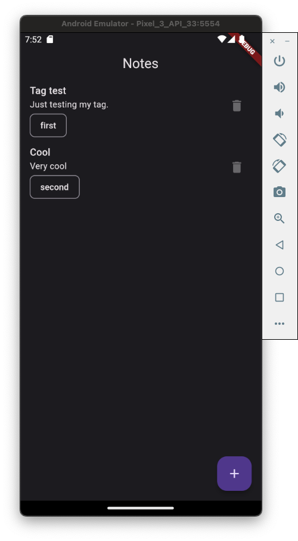
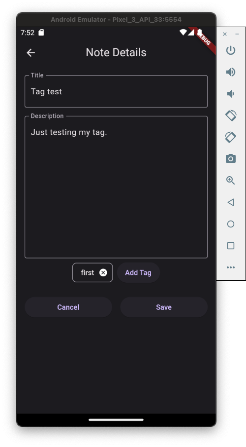
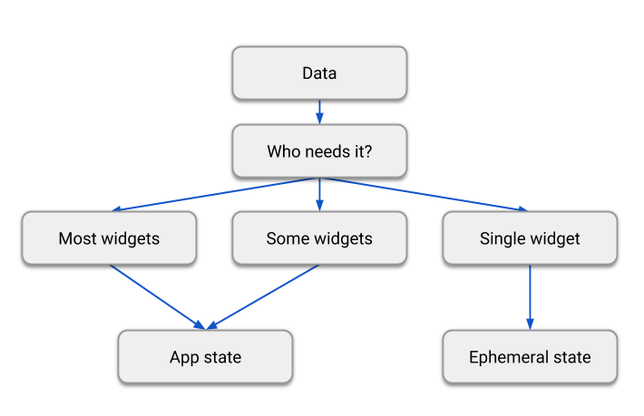

# dojo_flutter_note

## What to expect

1. The app will allow the user make a CRUD in notes with:
- title - String (required)
- description - String (required)
- tag - List<String> (nullable)

2. The app will allow the user to make a CRUD in tags

And that's how the app looks like:

## About the project
The app was created using:
- Flutter 3.7.5
- Dart 2.19.2
- DevTools 2.20.1

## Screens
1. Home screen - List the notes saved on the app
2. Note detail - Display the detail of an exisiting note allowing user to edit a note or allow user insert detail to create a new one
3. Tags screen - Display tags
4. Tag details - Display the detail of an exisiting tag allowing user to edit a tag or insert a new one (Let some functions to be done on DOJO)

## Run on your PC
- open the terminal on project folder
- execute the command `flutter pub run build_runner build --delete-conflicting-outputs` to generate the database
- still in terminal with a connected device execute `flutter run`

---
# DOJO
- [Flutter is a framework](#flutter)
- [Dart is the language used to develop on that framework](#dart)
- [What are the views in Flutter?](#views-in-flutter)
- [What is Ephemeral state and App state](#state-management)
- [How to navigate through the screens?](#navigation)

---
## [Flutter](https://docs.flutter.dev)
---
## [Dart](https://dart.dev/overview)
---
## [Views in Flutter](https://docs.flutter.dev/get-started/flutter-for/android-devs#what-is-the-equivalent-of-a-view-in-flutter)
---
## [State management](https://docs.flutter.dev/data-and-backend/state-mgmt/ephemeral-vs-app)

---
## [Navigation](https://docs.flutter.dev/cookbook/navigation)